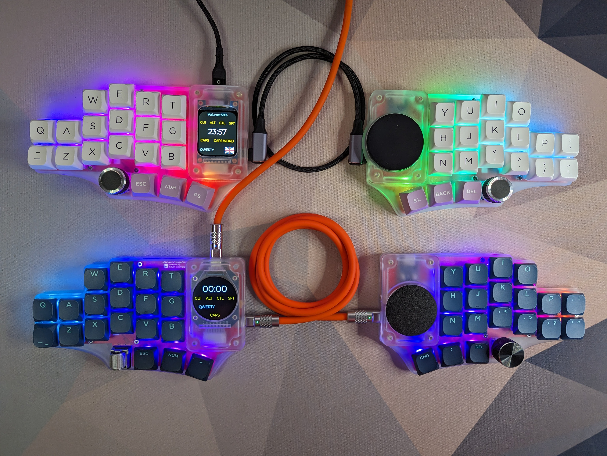

# stront

Split keyboard with 38 keys, LCD display and Cirque trackpad.

## Features

- MX, KS-33 or Choc switches
- wired split with USB-C or TRRS interconnection
- 38 keys
- roller/rotary encoders
- LCD display (1.69" 240x280 by default)
- Cirque trackpad (40mm by default)
- 2-key pinky columns
- 3D printed cases
- [VIK](https://github.com/sadekbaroudi/vik) support - **MX/KS version only**

**PCB has all SPI/I2C contacts exposed, so any other device can be used instead, it's just a matter of changing the case (at least that's the idea).**

## Photos

#### Choc version

#### MX Version

#### Display with PC companion app

https://github.com/zzeneg/stront/assets/910255/bb812821-9b2b-454a-a9a5-45d696a1f5aa

## Firmware

[Companion app](https://github.com/zzeneg/qmk-hid-host) for Raw HID communication.

QMK

- [source code](https://github.com/zzeneg/qmk_firmware/tree/feature/stront/keyboards/stront)
- [pre-compiled files](./firmware/qmk/)

Vial

- [source code](https://github.com/zzeneg/vial-qmk/tree/feature/stront)
- [pre-compiled files](./firmware/vial/)

Compiled versions:

- `default` - sample keymap with home row mods. Not recommended for longer use - create your own.
- `hid` - default keymap with HID support. Requires companion application.
- `zzeneg` - my highly customized layout.
- `*-rect` - version with rectangular display (ST7789 240x280)
- `*-round` - version with round display (GC9A01 240x240)
- `*-flat` - version with flat Cirque
- `*-curved` - version with curved Cirque

## Build Guide

[MX/KS version](./build-guide/mx/readme.md)

[Choc version](./build-guide/choc/readme.md)

## VIK - MX/KS version only ⚠️

> VIK is a standard for a data interface between printed circuit boards. It is intended to provide modularity between a mechanical keyboard PCB and additional features.

[VIK repository ](https://github.com/sadekbaroudi/vik)

#### Certification card

| Category               | Classification       | Response                          |
| ---------------------- | -------------------- | --------------------------------- |
| FPC connector          | Required             | :heavy_check_mark:                |
| Breakout pins          | Recommended          | :heavy_check_mark:                |
| Supplies: SPI          | Strongly recommended | :heavy_check_mark: [1] |
| Supplies: I2C          | Strongly recommended | :heavy_check_mark: [1] |
| I2C on main PCB        | Discouraged          | No                                |
| I2C pull ups           | Informative          | Optional[2]            |
| Supplies: RGB          | Strongly recommended | :heavy_check_mark:                |
| Supplies: Extra GPIO 1 | Required             | Digital                           |
| Supplies: Extra GPIO 2 | Required             | Digital                           |

**[1]**: I2C and SPI use same pins, so you can use only one or the other, not both. Selection is configured in firmware.

**[2]**: PCB has pads designed for 1206/3216 SMD resistors, you can solder them manually if needed.

#### VIK usage

Built-in display and trackpad use the same interface, so any additional VIK module will have to replace one of them. Depending on the size it can integrated into the cover or a standalone case.

All possible connectors support VIK - FPC horizontal on the back, FPC vertical on the front and the breakout pins.

## Support

If you like my work and want to support my future designs, please consider [sponsorship](https://github.com/sponsors/zzeneg).

#### Sponsors

Thank you very much for your support!

